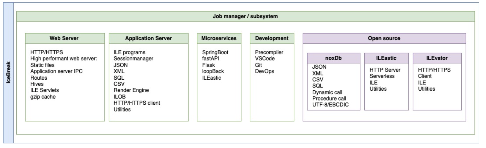

# noxDb Tutorial 
RPG tutorials using noxDB

noxDb is a powerful JSON,XML,SQL and program/serviceprogram framework for ILE on the IBM i™. noxDb makes it easy to manipulate and construct complex and dynamic data structures with a simple set of procedure calls from a RPG/ILE program.


noxDb runs natively on IBM i™ in the ILE environment - no PASE or any other moving parts.

# Install noxDb
First you need the noxDb framework for RPG / ILE. 

Follow the installation process 

https://github.com/sitemule/noxDb


I am use IceBreak applications server for this tutorial - however, this is not required - but makes life so much easier since noxDb is shipped within IceBreak. 

# Install IceBreak
IceBreak is a web application server for RPG / ILE. It is a simple and easy to use web server for the ILE environment - optimized for ILE and IBM i.

You can install IceBreak from the following link:
https://install.icebreak.org


___
## Install the tutorials via IBM i

Before you can clone this git repo - you first need to install **git** with **yum** your IBM i:

So first !! You need to ensure that the **ssh** daemon is running on your IBM i. So from a IBM i menu prompt start the SSH daemon:

```
===> STRTCPSVR *SSHD
```

... Then you can install **git**
  
1) Open ACS and click on "Tools"
2) Click on "Open Source Package Management"
3) Open the "Available packages" tab
4) Click "git" and "Install"


Now back to your ACS:

1) Click SSH Terminal in ACS ( or use your default terminal like putty) 

(or you can use call qp2term – but I suggest that you get use to ssh)

2) From the terminal. You can also install git with yum from the commandline if you don't like the above:  
```
ssh MY_IBM_I
PATH=/QOpenSys/pkgs/bin:$PATH
yum install git
```
And now in the same ssh session - clone the tutorials repo 
```
cd /prj
git -c http.sslVerify=false clone https://github.com/NielsLiisberg/noxDb-tutorials.git
```
As you can see - you have to adjust your path to use yum, git and other opens source tooling  

Go back to a 5250 prompt
```
GO ICEBREAK 
```
```
CALL QCMD
```
```
ADDICESVR SVRID(noxdbtut) TEXT('noxDb tutorials') 
    SVRPORT(60666) HTTPPATH('/prj/noxDb-tutorials') 
    WWWDFTDOC('app/index.html') DISPTHRMTH(*MULTITHREAD)         
```
```
STRICESVR noxdbtut
```
```
WRKICESBS 
```
You will see the tutorials server **NOXDBTUT** running in the IceBreak subsystem. Now we need to compile some of the tutorials -still in the 5250 with IceBreak on the library list ( more fun later from VSCode):

```
CRTICEPGM STMF('/prj/noxDb-tutorials/router.rpgle') SVRID(NOXDBTUT)
```
```
CRTICEPGM STMF('/prj/noxDb-tutorials/employee.rpgle') SVRID(NOXDBTUT)
```

# Build the sample database.
In the tutorials folder you will find a file called **/sql/corpdata.sql**. This is a SQL script that will create the database and the tables used in the tutorials.
You can run the script from ACS or from the command line. 

# Run the first sample
Now it is time to test the sample:

1) Open your browser
2) In the URL type [http://MY_IBM_I:60666](http://MY_IBM_I:60666)  Where MY_IBM_I is the TCP/IP address or name of your IBM i. Or even add the name MY_IBM_I to your ```hosts``` file on your PC 
[Edit host file](https://www.howtogeek.com/howto/27350/beginner-geek-how-to-edit-your-hosts-file/)

Now you have a RPG services using noxDb running with an MVVM application in ExtJS as you frontend.

# Tutorials step by step
The tutorials are build around the sources named NTUT00 to NTUT99 and can be run individually a simple application that uses the noxDb framework to build a web application. 

#### Basic features:
- NTUT00: Load a dataset from a table with SQL and save the data as JSON on the IFS.
- NTUT01: Load a dataset from a table with SQL and responds the JSON as a service request
- NTUT02: Like NTUT01, but takes a input parameter to query / filter the result
- NTUT03: Load a aggregated (complex) tree from two tables and responds the graph

#### Http request:
- NTUT04: Load the graph with data from a HTTP request to an external service
- NTUT05: Combine NTUT03 and NTUT04 - complex graph with added data from a HTTP request.
- NTUT06: Cache data from a HTTP request and update a list in the graph

#### Api interface:
- NTUT10: Data into and data Gen.
- NTUT20: Call dynamic service program procedure as JSON in / JSON out.


#### Utility:
- NTUT99: POR (Plain Old RPG) example program to calculate a salary


# Using VSCode as you IDE
The Sitemule team has made a cool plugin for VSCode so you can edit and compile RPG code.

In your browser open, download and install VSCode 

https://code.visualstudio.com/download


When you open VSCode then:

Open "Extensions" and search for "RPG".
Click on "RPG for IBM i" and you have installed what you need.

If you now map a network drive to the /prj/noxDb-tutorials folder and "drag" that into the VSCode editor - it will open it as workspace (a project) and now the noxDb compiler is available.

When you click and open a file with RPGLE or SQLRPGLE extension then you can press "Shift-Cmd-B" for build. Or find the build task in the menu.

# Microservices
In the tutorials above is as close as you can get with RPG to the Microservice architecture. It is build around a "router" program and a "JSON in/JSON out" service program. This design pattern hides the HTTP protocol so it can be used in stored procedures, data queues and even called directly from other RPG programs. This allows you to make unit test and let your RPG applications work better in a DevOps environment.

The "router" program is always called if the URL begins with "router". It is a regex set in the webconfig.xml. The router parses the URL, parse the input JSON and call the required service. Finally the router serializes the object graph into JSON for the HTTP client.

```xml
<routing strict="false">
    <map pattern="^/router/" pgm="router" lib="*LIBL" />
</routing>
```

Take a look at "router.rpgle" and "employee.rpgle" - they carry the whole secret!


# Consuming Services
Under the covers noxDb are using cUrl, so you have to installed that first:

From the ssh / shell prompt:
```
PATH=/QOpenSys/pkgs/bin:$PATH
yum install curl
```
Before you run the client example you have to set up two things: 

2) Set the PATH environment for you job to include the open source tooling - like:

System wide once:

```
ADDENVVAR 
    ENVVAR(PATH) 
    VALUE('/QOpenSys/pkgs/bin:/QOpenSys/usr/bin:/usr/ccs/bin:/QOpenSys/usr/bin/X11:/usr/sbin:.:/usr/bin')
    LEVEL(*SYS)                                                   
```

Or within the job
PATH=/QOpenSys/pkgs/bin:$PATH

Here is a nice description of how to set up the PATH:

https://ibmi-oss-docs.readthedocs.io/en/latest/troubleshooting/SETTING_PATH.html


1. Open the the source **employee.rpgle** by double clicking the name in the VSCode "Explorer" window.
2. The source for **employee.rpgle**  will now appear in editor window.
3. If you press: Build. That is ```CTRL-b (win)``` OR ```Command-B (mac)```  OR click ```View->Command Palette->Build->Build: Run Build Task``` then the *noxDb build system* kicks in.
4. Now select the ```noxDb Compile From IFS to application library``` will appear. Select that.
5. In the status bar ( the bottom left of the VSCode screen) You can see The number of **Warning, Info and Errors** in the code.
6. Clicking  **Warning, Info and Errors** will bring up the *"PROBLEMS"* window.
7. You will see the ```employee.rpgle" / "OK compile of /prj/noxDb-tutorials/employee.rpgle for server NOXDBTUT``` with a blue info icon to the left.
8. If not... Click on the error icon and it will bring you to the *"PROBLEM"* in the code. It will place the cursor on the line with error and show the compiler error associated with that line.
9. Fix the error - and press <CTRL-b> for build again. That is step 3.
10. No errors? Great !! Click on the search icon in the browser application you already have running at [http://MY_IBM_I:60666](http://MY_IBM_I:60666) 
11. We have a service running !! Now examine all the other examples. Perhaps some treasures are hidden there ;) 


... Hey wait a minute!! When i look in the *browser console network trace* - it refers to a resource called **router** - is this a magic word? 

No! magic perhaps, but it actually the noxDb Just In Time (JIT) compiler that behind the scenes compiles the router code because the IBM i object does not exists for that source - or the source code is modified AFTER the object was created. 

Please fell free to open and edit the **router.rpgle**. This is an essential part of microservices. Perhaps you would like to add Oauth2 with  JWT - JSON webtokens like this:

https://github.com/sitemule/ILEastic/tree/master/plugins/jwt

Perhaps it is time to look at the documentation. The admin-server also provides that: [http://MY_IBM_I:7000](http://MY_IBM_I:7000)  or skip to the section [Run the first sample](#Run-the-first-sample) that covers the above in more details.

### More inspiration? 
A project leveraging noxDb is the noxDbApi project. Providing RESTfull endpoint to SQL views, SQL procedure and table functions. It also - on the fly - provides full OpenAPI (swagger) interface .. all done by noxDb:  

https://github.com/sitemule/noxDbApi


Happy noxDb coding.

*Niels Liisberg.*

Have fun - and keep me posted :)

### Some background
noxDb is 100% open source. It is carved out of the professional applications server project called IceBreak - With thanks to the Sitemule team . 




